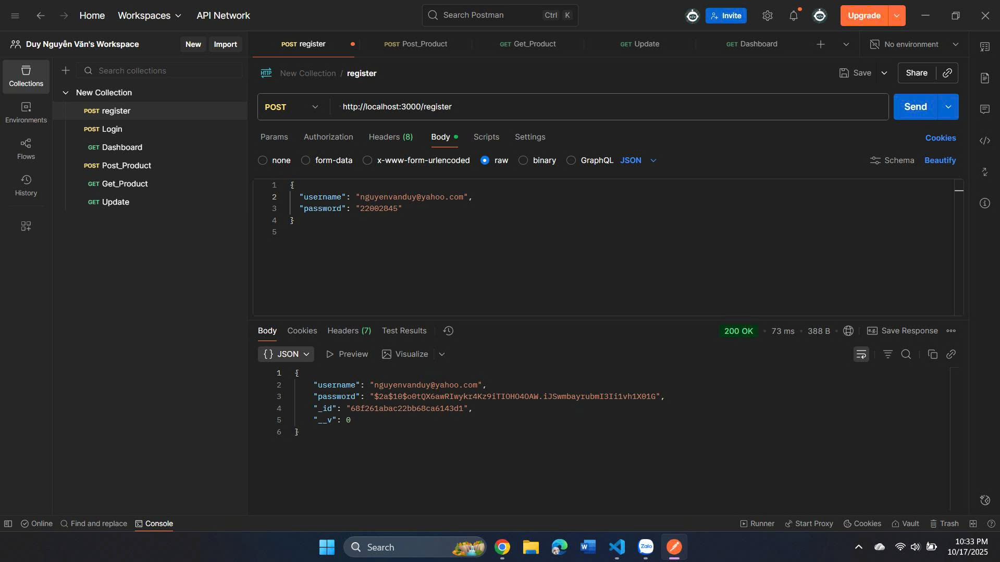
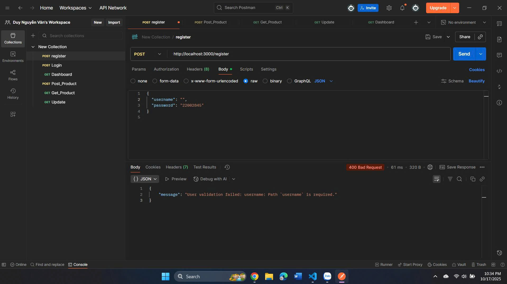
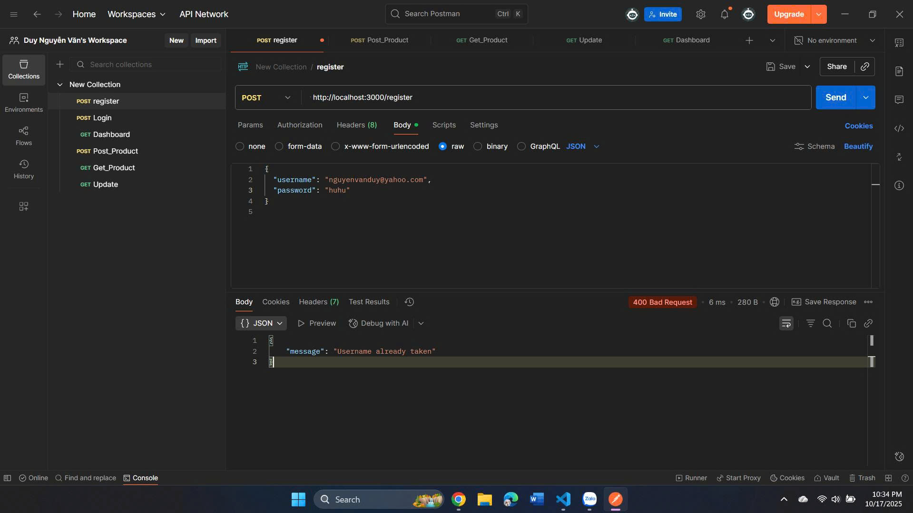
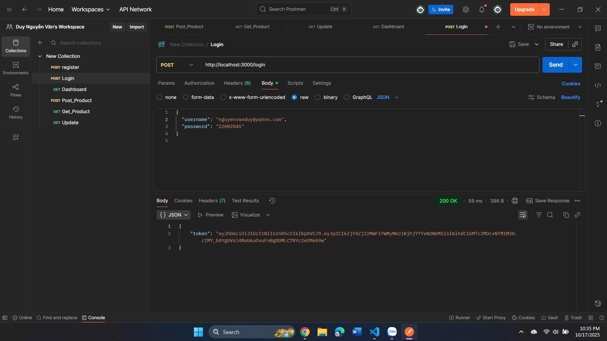
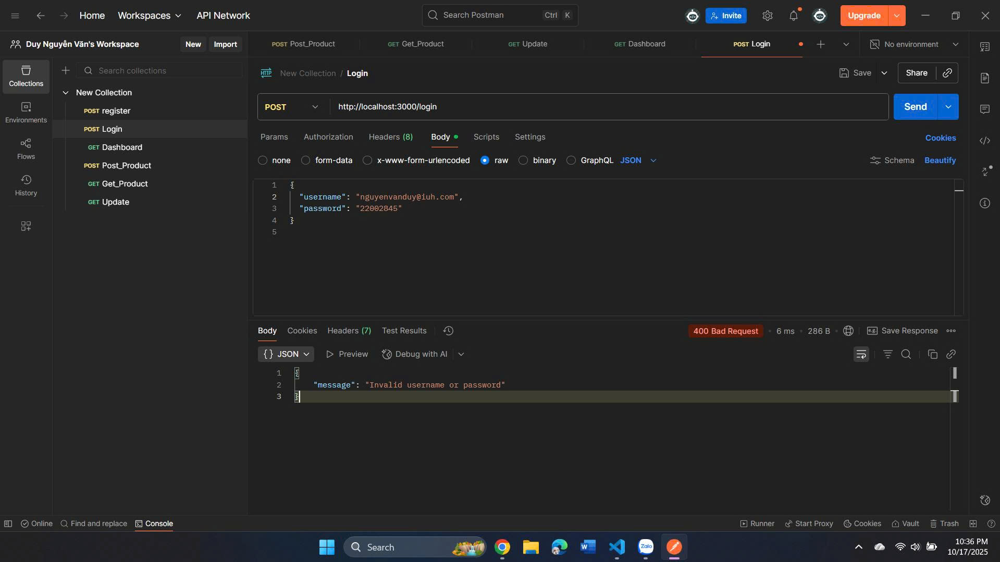
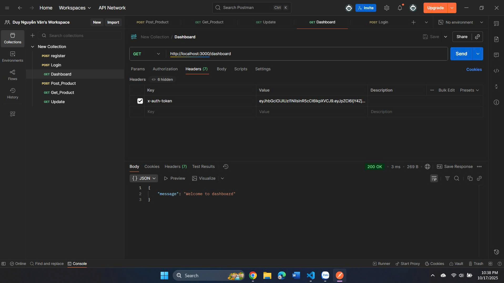
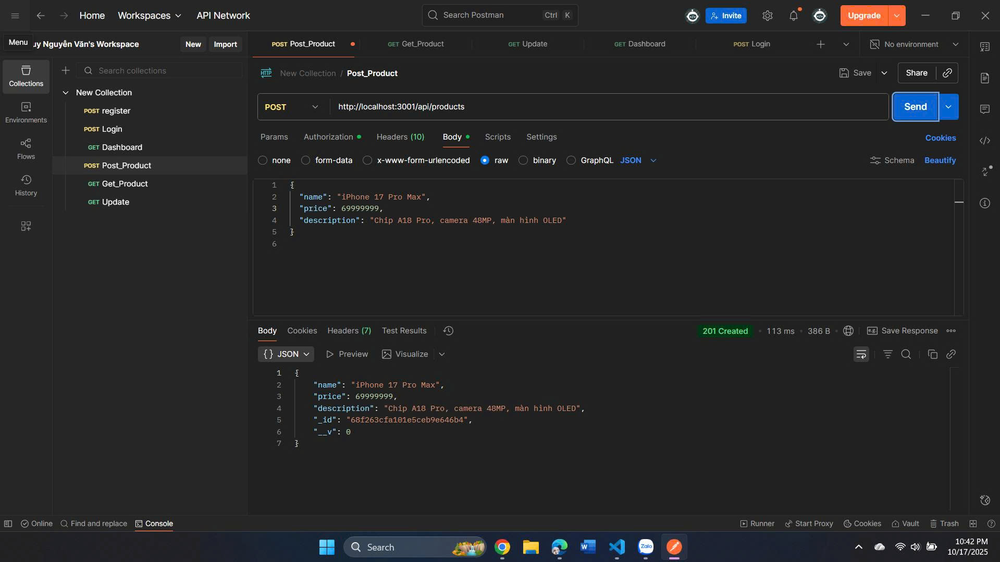
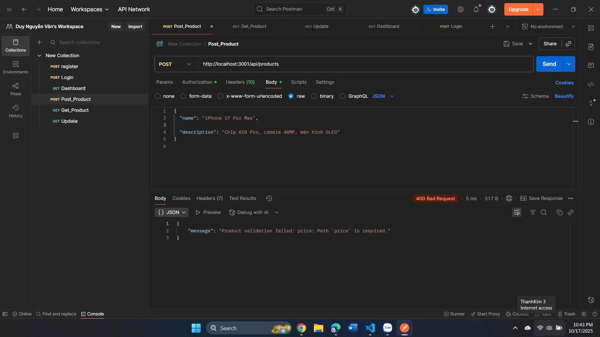
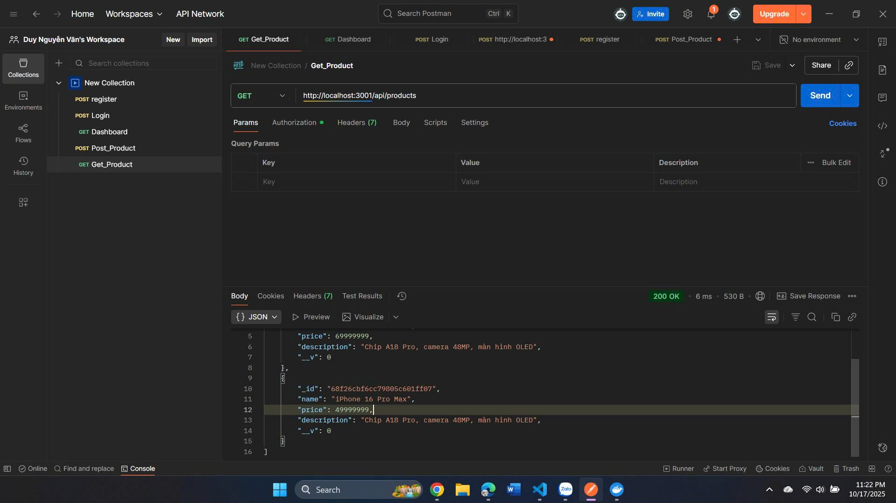
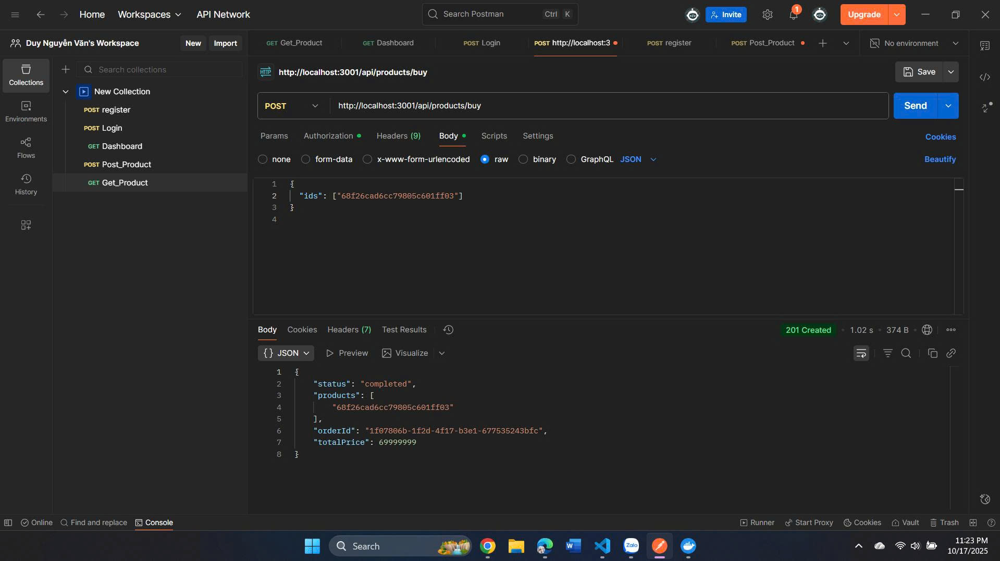

🛒 EPROJECT PHASE 1
📘 Giới thiệu

Dự án EPROJECT PHASE 1 là giai đoạn đầu của hệ thống thương mại điện tử, bao gồm các chức năng chính như:

Quản lý người dùng (đăng ký, đăng nhập, xác thực)

Quản lý sản phẩm

Quản lý đơn hàng

Tích hợp API Gateway cho giao tiếp giữa các service

## REGISTER

## REGISTER TEST - BỎ TRỐNG TÀI KHOẢN / MẬT KHẨU

## REGISTER TEST - TRÙNG TÀI KHOẢN

## LOGIN

## LOGIN TEST - TÀI KHOẢN CHƯA ĐĂNG KÝ

## DASHBOARD

## POST PRODUCT

## POST PRODUCT TEST - NHẬP THIẾU GIÁ

## GET PRODUCT

## BUY

